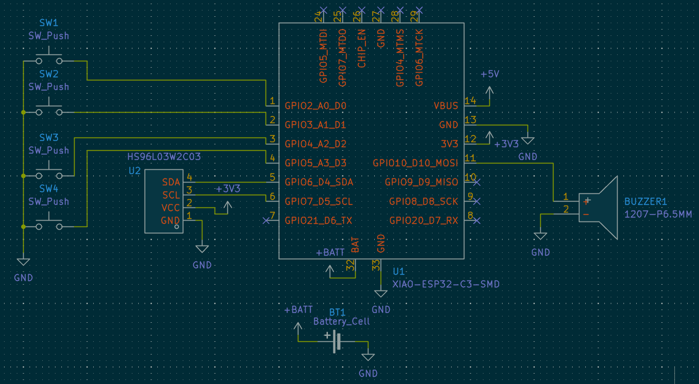
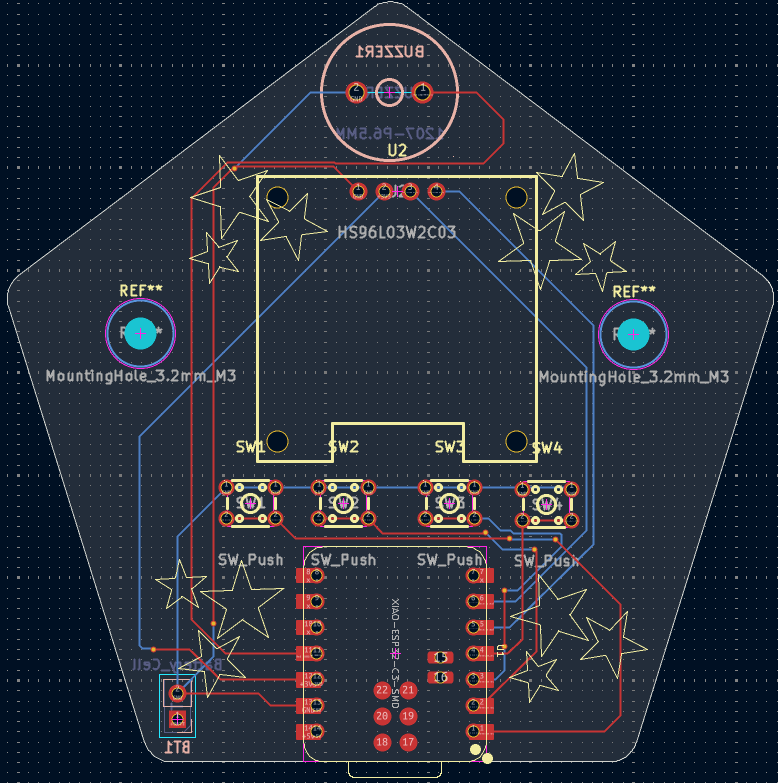
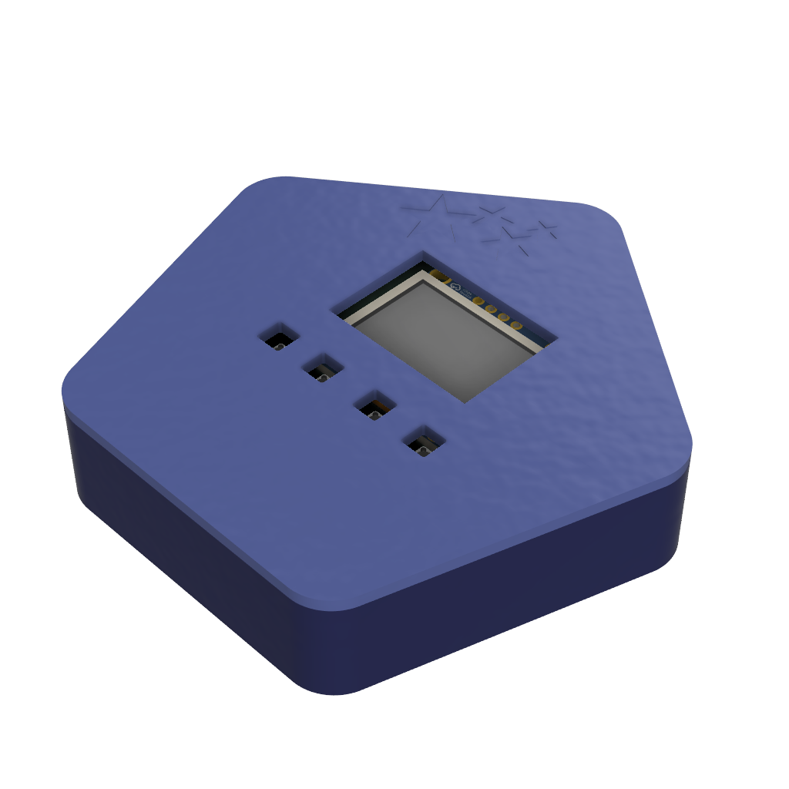
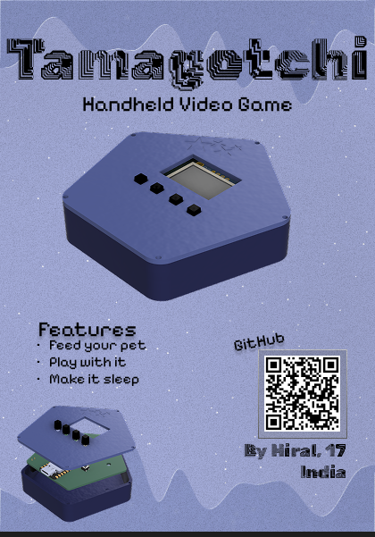

# Tamagotchi

This is a Tamagotchi. It is a small handheld video game in which you have a pet. You can play with it, feed it and more depending on your firmware code.

## Schematic

## PCB

## Case

## BOM

## Zine

## Why did I make it?

I made it for Fallout. Making this improved my electronics skills. I now know that I should read datasheets to understand how a pin on a component works. Because of this, I had to work on CAD which are now a lot better than before.