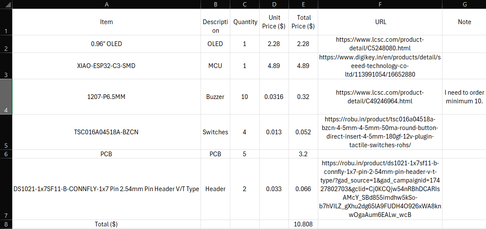

# Tamagotchi

This is a Tamagotchi. It is a small handheld video game in which you have a pet. You can play with it, feed it and more depending on your firmware code.

## Features

- Play with the pet!
- Feed it!
- Make it sleep!

You can always customise the firmware to make it do what you want!

## Schematic

Here's the schematic for the Tamagotchi. It has XIAO-ESP32-C3-SMD as its MCU. It has an OLED display, a buzzer, 4 switches and a battery cell.

## PCB

Its a pentagon shaped PCB, which has stars on it silkscreen.

## Case

I made the case using Fusion. It has stars on the top case (goes with the PCB).

## BOM

Here you can find the [BOM](BOM.csv)!

## Zine

## Why did I make it?

I made it for Fallout. Making this improved my electronics skills. I now know that I should read datasheets to understand how a pin on a component works. Because of this, I had to work on CAD which are now a lot better than before.